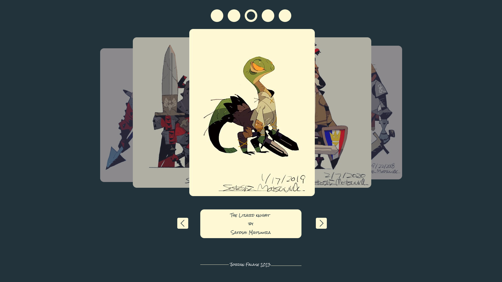

# Images Carousel

## Goal

The goal here is to build a vanilla HTML, CSS and JavaScript application that can slide through a sequence of images using navigations buttons. I intent to use this project to experiment with various CSS properties i'm not familiar with like **position** or **z-order**. I also want to test libraries like [slick](https://kenwheeler.github.io/slick/), [glide](https://glidejs.com/) or [sliderm](https://sliderm.com/docs/) because the ability to adapt fast by using various APIs and integrating them in a project seems to be crucial for a developer nowadays. If i have to build a portfolio, that's something i definitely want to show off from the get-go.

## Mockup

This was built using Figma which is an application i only started to use recently but am already fond of. The interface is great and i like the process of prototyping so much i decided to include it into my workflow. It's so much easier to build an application when you have something akin to a blueprint to guide you along the way.

## Sources and references

- [CSS Carousel - FreeFrontEnd.com](https://freefrontend.com/css-carousels/)
- [How to transition z-index property - Stack Overflow](https://stackoverflow.com/questions/46384799/how-to-transition-z-index#46384969)